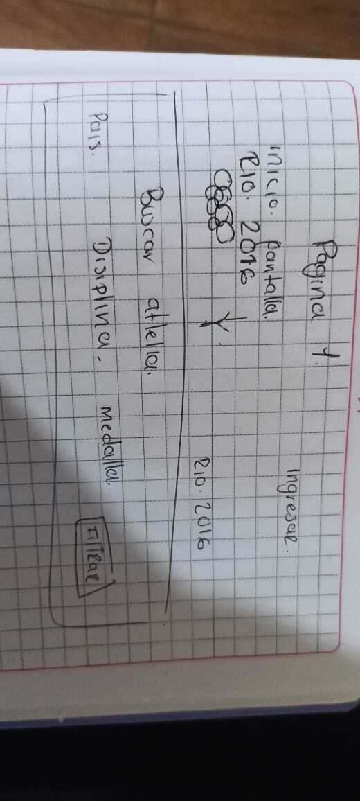
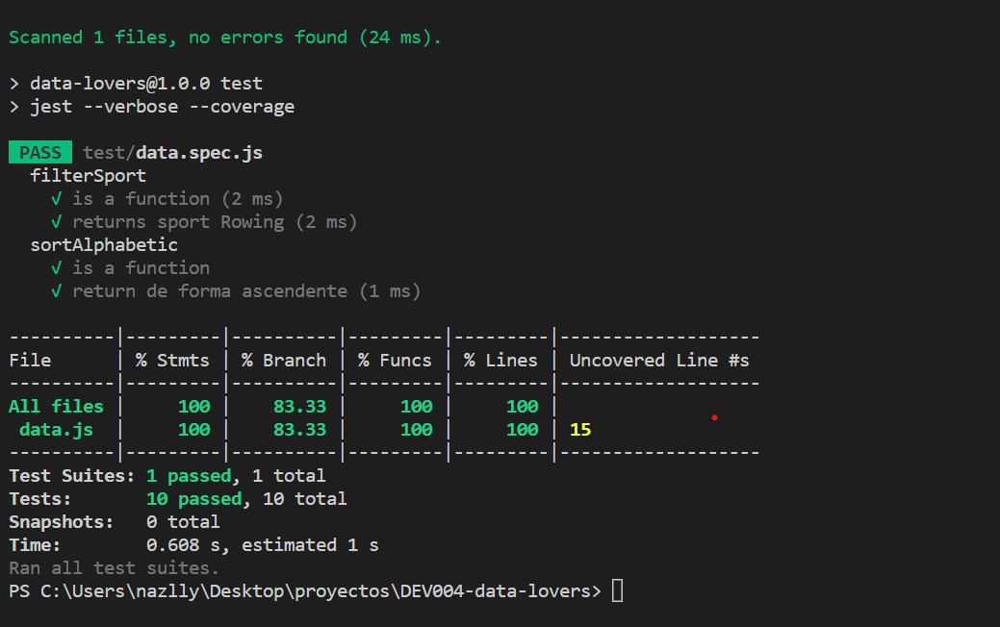
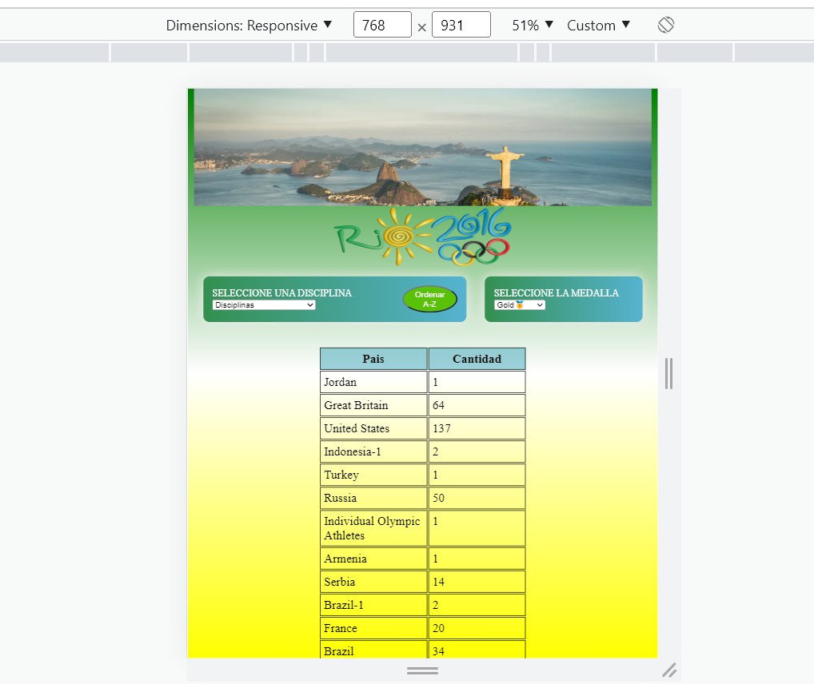
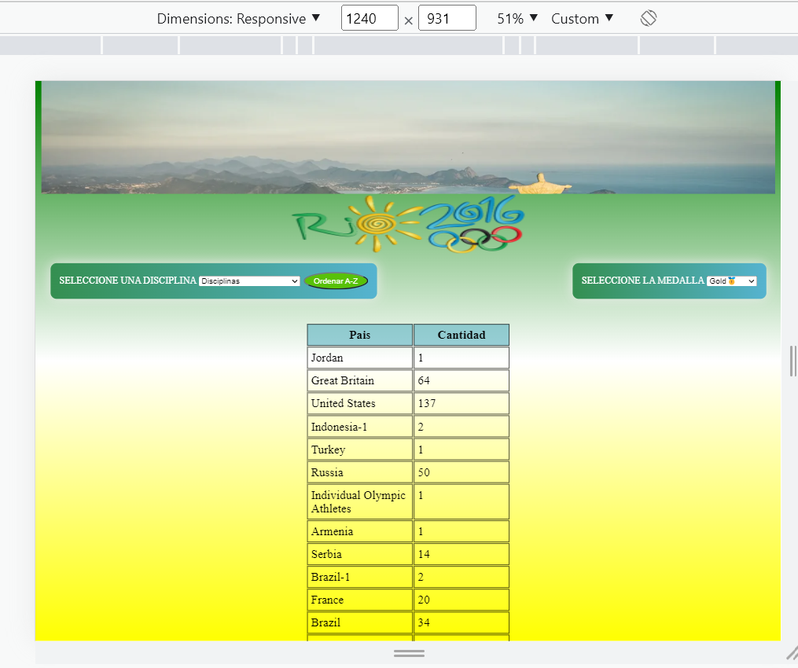

# Data Lovers

***

## 1. Resumen del Proyecto
En este proyecto se contruyo una pagina web donde por medio una data donde le permitamoos al usuario visualizar, filtrar, ordenar y calcular de manera facil e interactiva.

## 2. Descripcion del Proyecto
esta  paginaes una propuesta de interaccion con informacion de los juegos olimpicos rio 2016, en la  que se puede interactuar de manera facil con esta  informacion y ademas aprender sobre las diferentes diciplinas y las cantidad de medallas que ganaron lo diferentes paises y haci generar una amplia cultura en conocimiento de deporte , esta  pagina  fue  pensada  para  cualquier  usuario que  desee  conocer  sobre  los  juegos  olimpicos  ya sea  de manera  recreativa  o de prendizaje.
## Hallazgos
se puedo descubrir que esta  informacion no solo en necesaria solo para  personas que desee hacer  consultas  por  investigacion de colegio o preparatorias , si no para tambien parra  personas  interesadas  en saber  ma por  recreacion .

## 3. Objetivos de aprendizaje
los objetivos que se han llegado a entender y aplicar en el proyecto.

### HTML

- [x ] **Uso de HTML semántico**
- [ x] **Uso de selectores de CSS**
- [x ] **Modelo de caja (box model): borde, margen, padding**
- [x ] **Uso de flexbox en CSS**

### Web APIs

- [x ] **Uso de selectores del DOM**
- [x ] **Manejo de eventos del DOM (listeners, propagación, delegación)**
- [x ] **Manipulación dinámica del DOM**

 ### JavaScript

- [ x] **Diferenciar entre tipos de datos primitivos y no primitivos**
- [ x] **Arrays (arreglos)**
- [ x] **Objetos (key, value)**
- [ x] **Variables (declaración, asignación, ámbito)**
- [ x] **Uso de condicionales (if-else, switch, operador ternario, lógica booleana)**
- [ x] **Uso de bucles/ciclos (while, for, for..of)**
- [ x] **Funciones (params, args, return)**
- [ x] **Pruebas unitarias (unit tests)**
- [ x] **Módulos de ECMAScript (ES Modules)**
- [ x] **Uso de linter (ESLINT)**
- [ x] **Uso de identificadores descriptivos (Nomenclatura y Semántica)**
- [ x] **Diferenciar entre expresiones (expressions) y sentencias (statements)**

### Control de Versiones (Git y GitHub)

- [ x] **Git: Instalación y configuración**
- [ x] **Git: Control de versiones con git (init, clone, add, commit, status, push, pull, remote)**
- [ x] **Git: Integración de cambios entre ramas (branch, checkout, fetch, merge, reset, rebase, tag)**
- [ x] **GitHub: Creación de cuenta y repos, configuración de llaves SSH**
- [ x] **GitHub: Despliegue con GitHub Pages**
- [ x] **GitHub: Colaboración en Github (branches | forks | pull requests | code review | tags)**

### Investigación

- [ x] **Planear y ejecutar testeos de usabilidad de prototipos en distintos niveles de fidelidad**

## 4. Historias de usuario

#### Prototipo de baja fidelidad

#### Prototipo de alta fidelidad

## 5. Testeos de usabilidad

se realiza el testeo de las funiones aplicadas en el proyecto las  cuales  fueron realizadas y aplicadas al proyecto

### Pruebas unitarias,problemas encontrados

en el tes  se presentaba  problemas  como el de que  pasaba las funciones tasn de  filtrado como el de  calculo y  ordenar  pero no pasaba  el testeo por  ejemplo.

al reconocer  esto incimos  un cambio completo realizamos  un testeo con la  compracion de una data  y lo esperado de esta manera  pudimos  realizzar  este  testeo 

## 6. Proyecto terminado imagenes responsive
proyecto movil

proyecto tablet

proyecto destock

### Checklist

* [ x] Usa VanillaJS.
* [ x] Pasa linter (`npm run pretest`)
* [x ] Pasa tests (`npm test`)
* [ x] Pruebas unitarias cubren un mínimo del 70% de statements, functions y
  lines y branches.
* [ x] Incluye _Definición del producto_ clara e informativa en `README.md`.
* [x ] Incluye historias de usuario en `README.md`.
* [ x] Incluye _sketch_ de la solución (prototipo de baja fidelidad) en
  `README.md`.
* [x ] Incluye _Diseño de la Interfaz de Usuario_ (prototipo de alta fidelidad)
  en `README.md`.
* [x ] Incluye el listado de problemas que detectaste a través de tests de
  usabilidad en el `README.md`.
* [x ] UI: Muestra lista y/o tabla con datos y/o indicadores.
* [x ] UI: Permite ordenar data por uno o más campos (asc y desc).
* [x ] UI: Permite filtrar data en base a una condición.
* [x ] UI: Es _responsive_.

